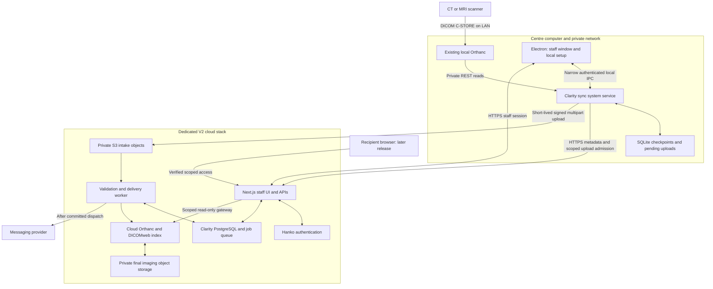
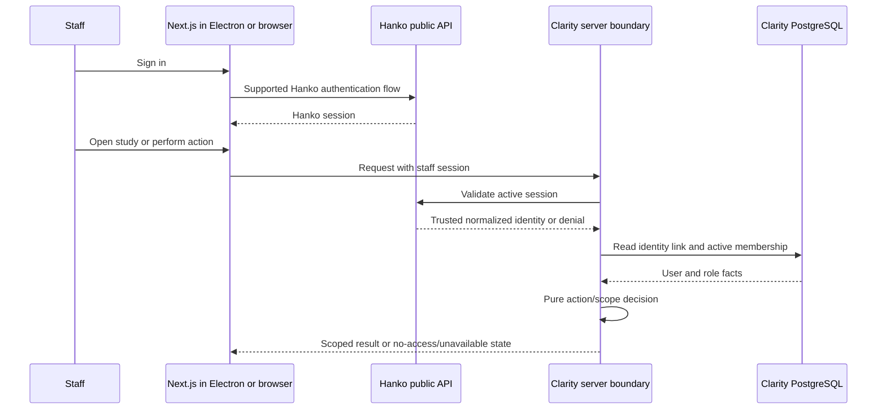
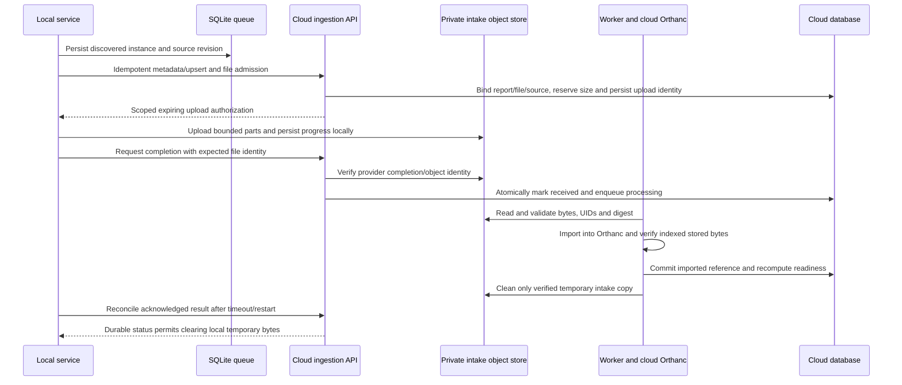
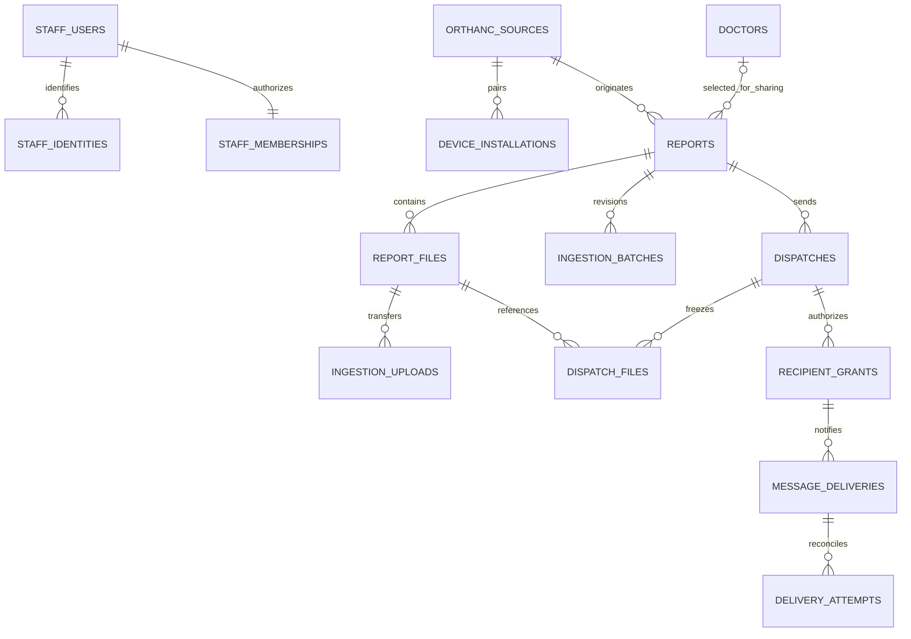

# 01 — Clarity V2 desktop and automatic Orthanc ingestion

> **Version:** 1.2  
> **Date:** 2026-09-23  
> **Author:** Codex, using the Planning Doc Generator and ICM Architect skills  
> **Goal:** A simple installed staff application with unattended local Orthanc ingestion, a dedicated cloud backend and Hanko staff authentication.  
> **Status:** Synthetic worker crash recovery, Hanko staff web and local Chromium cookie proofs passed; connected ingestion, clinical viewing, installers and deployment pending.

## Contents

0. [Final goal and success state](#0-final-goal-and-success-state)
1. [Requirements](#1-requirements)
2. [Diagnosis and architecture](#2-diagnosis-and-architecture)
3. [Implementation details](#3-implementation-details)
4. [Implementation checklist](#4-implementation-checklist)
5. [Traceability and verification](#5-traceability-and-verification)
6. [Delivery and external inputs](#6-delivery-and-external-inputs)

## 0. Final goal and success state

### Final goal

Build V2 in `/Users/valekar/Projects/clarity-v2`, separately from the existing
`clarity` application. Install one Clarity desktop product on Windows or macOS.
Its independently managed system service reads a private local Orthanc API,
creates cloud Reports from study metadata and transfers DICOM automatically.
Staff use a small dashboard to find a Report, view its images, enter the patient's
mobile, select/add a referring doctor and generate/send recipient links.

The Electron app reuses the hosted Next.js interface. PostgreSQL, object storage,
cloud Orthanc/indexing, Hanko and message delivery stay in the dedicated V2 cloud
stack. **Standalone means one centre's independent product/deployment, not a fully
offline app or a complete backend installed on every workstation.** A cloud outage
does not erase local work; it does prevent cloud-dependent staff operations.

### User-visible outcome

Studies appear automatically, initially showing Syncing, then Ready or Needs
attention. Staff never type study metadata merely to create a record and do not
upload DICOM manually. Phone numbers are entered/confirmed on the sharing screen;
doctor selection fills its number. Staff can review prepared patient/doctor
messages. The backend performs delivery after explicit Generate and send.

### System outcome

Synchronization continues after Electron quit, screen lock or OS logout, while
the service host is running and dependencies are reachable. At boot the OS starts
the service; source/cloud outages pause affected work and trigger bounded recovery
checks. Persistent checkpoints, upload state and idempotent cloud transactions
allow crash recovery. Power-off/sleep cannot run work. Source files remain local
unless a separately approved retention policy later changes that.

### Non-goals

No modification, migration, deletion or replacement of V1 in this plan run. No
multi-business SaaS, branch switcher, subscriptions/billing, public Orthanc tunnel,
AI, archive tier, source cleanup, RIS/worklist integration, full offline staff
editing, Linux installer, browser DICOM intake wizard or universal viewer feature
parity. Hanko is the sole V2 staff identity provider; the user resolved the earlier
Auth0 wording on 23 September 2026.

### Acceptance snapshot and release slices

**Staff pilot:** a signed installer pairs one source; an actual OS service survives
quit/logout/reboot; a synthetic study appears exactly once after retries; all
expected instances are cloud-verified and render through the scoped staff viewer;
unauthorized/disabled staff cannot access them. The cloud copy works with the local
source disconnected. This is the first release target.

**Sharing release:** retain the earlier automatic-delivery objective, but do not
silently choose bearer-only recipient access. Resolve recipient verification,
then prove final Send, provider receipt/reconciliation, intended-recipient access,
revocation, seven-day expiry and frozen file scope. Until then, sharing can be
tested with synthetic recipients and a delivery stub; real external clinical
sharing remains disabled. Staff authorization is the immediate design focus.

## 1. Requirements

Priority P0 = required for staff pilot; P1 = required for sharing release or its
explicit prerequisite. S1 = latest V2 request; S2 = preceding discussion; S3 =
inspected current source/client UI; D = proposed engineering decision.

| ID | Requirement | Priority | Source |
| --- | --- | --- | --- |
| BR-01 | Separate V2 folder/application; preserve V1 implementation and data | P0 | S1 |
| BR-02 | One diagnostic centre, named staff and admin; defer other clinics/businesses | P0 | S1 |
| BR-03 | Orthanc automatically creates Reports; no manual DICOM intake as normal workflow | P0 | S1/S2 |
| BR-04 | Compact dashboard, source sync status and integrated staff viewer | P0 | S1/S3 |
| BR-05 | Patient number entry and doctor search/select/add on sharing screen | P1 | S2/S3 |
| BR-06 | Explicit Generate and send; backend delivery; copy and QR conveniences | P1 | S2/S3 |
| BR-07 | Expiry revokes access independently of stored-file retention | P1 | S2/V1/D |
| TR-01 | TypeScript, pnpm-workspace monorepo, Turbo, Next.js, Electron, shared libs/ | P0 | S1 |
| TR-02 | Windows/macOS installers include independent native-managed sync service | P0 | S1/S2 |
| TR-03 | Private Orthanc stays private; device initiates all cloud connections | P0 | S2 |
| TR-04 | Incremental discovery, persistent checkpoints, restart recovery and late-instance reconciliation | P0 | S2/D |
| TR-05 | Direct private object-storage intake; validate and index before Ready | P0 | S2/D |
| TR-06 | Hanko staff login plus application-owned permissions; no Clerk in V2 | P0 | S1 |
| TR-07 | Independent, revocable machine identity; logout does not stop sync | P0 | S2/D |
| TR-08 | Fresh constrained PostgreSQL schema, local SQLite queue, bounded transfers and idempotency | P0 | S1/D |
| TR-09 | Isolated Docker cloud services, backups, restore, health and signed releases | P0 | S1/D |
| TR-10 | ICM map/AGENTS/rules/templates; update on discussions and changes; no wiki | P0 | S1 |
| TR-11 | Selectively reuse verified owners/tests; no dependency on V1 checkout | P0 | S1 |
| TR-12 | Recipient access remains scoped and verified; migration cannot invent verified phone claims | P1 | S2/S3/D |

### Approved direction, proposals and open inputs

Approved: separate V2; Electron/Next.js/TypeScript/pnpm/Turbo; Hanko replacing Clerk
for V2; ICM instead of wiki; one-centre staff first; automatic private Orthanc
ingestion; service independent of user login; contacts at sharing time.

Proposed here: `clarity-v2` sibling name, single dedicated cloud stack, direct S3
intake followed by cloud Orthanc indexing, hosted Next.js inside Electron, email
passcode baseline, five-minute discovery, a service installed preferably on the
Orthanc host, fixed admin/staff roles and immutable dispatch snapshots.

Unresolved inputs have IDs in section 6. No answer is inferred as approval of an
external action. The plan can be reviewed while those release inputs remain open.

## 2. Diagnosis and architecture

### 2.1 Existing state and evidence

V1 HEAD inspected: `65d77d33dab802d31d15eb60d3d38c29f624846b` with pre-existing
documentation changes. It is already more than a mockup: source contains durable
uploads, imaging validation/readback, permissions, delivery/outbox and scoped
recipient access; its active plan distinguishes deployed synthetic acceptance from
unproven provider/device cases. See the [reuse assessment](research/reuse-assessment.md).

The main mismatch is ingress: V1 begins with manual patient/Report/file selection.
The client starts from local Orthanc studies and asks for contact information at
sharing time. V2 should keep the latter workflow and reuse sound V1 mechanics.
Rebuilding the boundaries is justified; rewriting all validation/security logic is
not required. No legacy security shortcuts are transferred for UI simplicity.

### 2.2 Proposed runtime boundaries



Cloud never initiates a request into the centre LAN. The sync service accesses
Orthanc via its REST API, not by reading Orthanc's database/storage directory.
The service is bundled with the installer but is not an Electron child whose
lifetime ends at app quit. The staff renderer never receives Orthanc or bucket
administrator credentials. No Docker Desktop is required at the centre.

### 2.3 Monorepo shape and package ownership — planned

The user authorized a foundation scaffold on 23 September and subsequently
requested phased implementation. The four application boundaries and the
contracts, domain, UI, database, server, storage, messaging and config libraries
now exist. The planned imaging library remains to be extracted from the worker's
bounded DICOM parser. Each working folder receives a short CONTEXT.md describing
inputs, responsibility, outputs and validation. A buildable shell is not a proven
clinical integration.

```text
clarity-v2/
  AGENTS.md, README.md, CONTEXT.md
  package.json, pnpm-workspace.yaml, pnpm-lock.yaml, turbo.json
  apps/
    web/                 Next.js hosted staff UI, route handlers and future recipient UI
    desktop/             Electron main/preload, local setup/status renderer, packaging
    sync-service/        independently launched Node service and local source adapter
    worker/              cloud validation/indexing, recovery and delivery jobs
  libs/
    contracts/           runtime schemas and versioned DTOs; browser-safe
    domain/              pure identity/readiness/sync/sharing decisions
    ui/                  shared Clarity visual primitives; no privileged imports
    database/            typed PostgreSQL repositories and migrations
    server/              cloud boundary services, Hanko auth and authorization
    imaging/             validation, DICOM metadata and cloud Orthanc adapter
    storage/             scoped object admission, completion and readback
    messaging/           chosen provider adapter and callback validation
    config/              shared TypeScript/lint settings with explicit consumers
  deploy/cloud/          Dockerfiles, Compose, Hanko and Orthanc configuration
  deploy/installers/     Windows service wrapper/install script; macOS pkg/launchd
  scripts/               build, migration, map and integrity tools
  tests/                 synthetic shared fixtures and cross-app acceptance
  docs/                  active plan, engineering rules, focused research/evidence
  map/                   catalog, contracts, object/decision/process/session cards
  .agents/skills/        project planning and ICM maintenance skills
```

Use pnpm workspace globs `apps/*` and `libs/*`, package names such as
`@clarity/domain`, and explicit `workspace:*` dependencies. Turbo orchestrates
tasks; pnpm resolves dependencies. Avoid both a `packages/` and `libs/` home for the
same kind of code. Apps must not import other apps. Pure/contracts packages cannot
depend on Node, Next.js, Electron, database or provider SDKs.

Node-consumed shared packages emit compiled ESM with explicit exports/import paths;
the desktop bundle handles browser/UI assets separately. Do not ship TypeScript
execution to installed service machines. Package the service with its own pinned
supported Node runtime; it must not depend on system Node, npm, pnpm or Electron
running. Select a maintained Windows service wrapper during the P0 prototype;
WinSW is a candidate, not an already-approved/pinned dependency.

Turbo build/test/typecheck tasks use dependency ordering. Development processes
are persistent and uncached. Migrations, signing, installation, real-provider tests
and deploys are uncached explicit tasks. Only deterministic synthetic artifacts
may enter a cache; keep remote caching off until secret/patient-data exclusions
are verified. Use relevant env inputs and explicit build outputs for cache safety.
Source: [Turborepo repository structure](https://turborepo.com/docs/crafting-your-repository/structuring-a-repository).

### 2.4 Reuse, replace and omit

The [reuse matrix](research/reuse-assessment.md) is the exact source-to-target
inventory. Preserve pure rules and integrity concepts; adapt their data boundary
and imports. Start a fresh V2 migration baseline and new staff enrollment.

Replace manual intake, browser-owned transfers, Clerk extraction, branch-heavy
navigation and legacy manual viewer links. Omit multi-centre UI, billing, Telegram
onboarding, complex channel fallback, examination catalogue and arbitrary local
ZIP viewing from the first build. No source code is moved, deleted or copied in
this planning run.

## 3. Implementation details

### 3.1 Staff experience and authorization

Navigation: Studies (dashboard), Doctors, Settings. Settings contains Staff access
and Connection/status for admins. Put sync progress and errors on the study row;
avoid separate operator dashboards until there is a demonstrated need.

Staff task: sign in → find automatically discovered study → check Ready/view →
open sharing screen → enter patient mobile/select doctor → review → Generate and
send. Viewing does not require a recipient phone. Editing contact information must
not change DICOM metadata or silently change previously dispatched destinations.

| Action | Staff | Admin |
| --- | --- | --- |
| List/view Ready studies and sync state | Yes | Yes |
| Enter contacts; search/select/add doctor; generate/send when enabled | Yes | Yes |
| Manage staff status/roles; pair/revoke device; change source settings | No | Yes |
| Delete local/cloud clinical files or alter retention | No feature | No feature |

Use fixed roles initially, no custom-permission builder. Every API and server
mutation checks current active membership; the sidebar is not authorization.
Protect doctor writes, view/download routes, metadata, delivery callbacks and all
device endpoints. Do not trust client-supplied role/centre/source assertions.

Patient names/dates/modality/IDs originate from Orthanc. Keep a Report-local
patient snapshot initially; a separate editable patient directory and automatic
cross-study patient merging are unnecessary. A later patient master needs explicit
source ID/issuer matching rules. Missing birth date/sex/accession/phone is allowed;
invalid required DICOM identity is not. Use distinct unknown labels, not fabricated
dates or ages. Source updates must not overwrite staff contact fields.

### 3.2 Hanko identity and session integration

[Hanko research](research/hanko.md) owns upstream findings and compatibility limits.
V2 uses self-hosted Hanko with verified email passcode baseline and optional proven
passkeys. Authentication records remain in Hanko; authorization remains in Clarity.

Planned owners: `libs/server/src/auth/hanko-session.ts`,
`libs/server/src/auth/require-staff-access.ts`,
`libs/domain/src/staff-access.ts`, `apps/web/src/app/sign-in/page.tsx`,
`apps/web/src/proxy.ts`, `libs/database/src/staff-repository.ts`.
Do not transplant ClerkProvider or literal Clerk subject assumptions.



No-access registration is safe: Hanko sign-in never self-promotes a staff member.
Bootstrap the first admin with an audited one-time operator procedure against a
verified Hanko subject; subsequent grants require an active admin. Enforce at least
one active admin under concurrency. Keep identity links unique by provider/issuer/
subject. Do not auto-link by unverified email or copy credentials from Clerk.

Use active-session validation, expiry checks and current membership at protected
boundaries. Distinguish auth outage (503/unavailable) from invalid session (401)
and insufficient permission (403). Passive status polling must not keep a human
session alive forever. Test logout, remote session revoke, membership disablement,
wrong issuer/audience, key rotation and stale open windows.

Cookie-authenticated mutations require trusted Origin/CSRF checks; CORS alone is
not CSRF protection. Configure Secure/SameSite cookie scope and trusted auth/UI
origins explicitly. Bound login, pairing and ingestion requests; keep clinical
responses private/no-store and credentials out of redirects and diagnostics.

The Electron dashboard keeps standard web security. Passkey/recovery support is a
P0 packaged-app experiment on both OS families. Do not assume Hanko provides a
general desktop OAuth/PKCE server or verified-mobile claims. OI-01 is resolved:
Hanko alone owns V2 staff authentication.

### 3.3 Desktop and independent service lifecycle

Planned owners: `apps/desktop/src/main.ts`, `src/preload.ts`,
`src/renderer/setup.tsx`, `src/renderer/sync-status.tsx`,
`apps/sync-service/src/main.ts`, `src/runtime/shutdown.ts`,
`deploy/installers/windows/` and `deploy/installers/macos/`.

Electron hosts the HTTPS Next.js dashboard and a small packaged local setup/status
screen. UI primitives can be shared, but no local Next.js server/database is needed
for the initial product. Select and pin a desktop bundler/packager after the P0
service-install prototype; verify its native installer hooks and license. A plain
DMG drag-and-drop does not by itself install a system daemon: macOS needs the
appropriate signed installer/approved service registration flow.

Windows: install a constrained service account, automatic service start and restart
on failure, dedicated data directory and named-pipe ACLs. macOS: system LaunchDaemon
(not a per-login LaunchAgent), dedicated data directory/user permissions and Unix
socket ACLs. Bundle the same compiled TypeScript service implementation with
platform adapters. Elevation is limited to install/update/remove operations.

Service setup accepts an admin-approved one-time pairing token and binds the
machine to one allowed source. Store its restricted credential for the service
identity, accessible without interactive login; verify Windows credential/ACL and
macOS system-keychain/service-access behaviour on real machines. A login-scoped
Electron safeStorage/keychain alone is insufficient for unattended service access.
Credential rotation/revocation pauses cloud admission without exposing secrets.

IPC exposes named operations: read status, test configured source, apply admin-
authorized configuration. Validate caller, operation and payload; never expose
arbitrary URLs, filesystem paths, SQL, shell commands or raw Electron APIs. Remote
web content cannot read local credentials or redirect the service to a new endpoint.

| Event | Required outcome |
| --- | --- |
| Window closed / Electron quit / staff sign-out / OS lock / OS logout | Service continues; staff UI session is independently enforced |
| OS boot completed | Service starts without opening Electron; OS encryption pre-boot unlock requirements still apply |
| Orthanc unavailable | Preserve work, report source unavailable, probe with bounded backoff; resume automatically |
| Cloud/storage unavailable | Stop admitting unbounded bytes; preserve queue, retry with jitter/backoff |
| Credentials revoked/invalid | Needs admin attention; no tight retry loop or anonymous fallback |
| Sleep/shutdown | Persist checkpoints, stop safely; reconcile when service resumes |
| Service crash/update | OS restart plus durable reconciliation; no new duplicate Reports |
| Low spool space | Pause new file reads, preserve existing work, visible capacity error |

Prefer installation on the Orthanc host; an always-on LAN computer is acceptable.
One designated sync owner per source; additional staff desktops are UI-only.
Cloud installation lease/fencing and uniqueness must also reject accidental second
owners. A five-minute discovery loop is not a five-minute upload SLA.

Sources: [Windows services](https://learn.microsoft.com/en-us/dotnet/framework/windows-services/introduction-to-windows-service-applications),
[launchd lifecycle](https://developer.apple.com/library/archive/documentation/MacOSX/Conceptual/BPSystemStartup/Chapters/CreatingLaunchdJobs.html),
[Electron isolation](https://www.electronjs.org/docs/latest/tutorial/security).

### 3.4 Orthanc discovery and payload normalization

Planned owners: `apps/sync-service/src/orthanc/read-changes.ts`,
`read-study.ts`, `read-instance.ts`, `src/discovery/discover-studies.ts`,
`src/persistence/queue-repository.ts`, `libs/contracts/src/orthanc.ts`.

Probe the installed Orthanc version/API capabilities and connectivity at setup.
Read `/changes?since=<checkpoint>&limit=<bound>` incrementally; persist discovered
work and the next sequence in one SQLite transaction. Advance the discovery
checkpoint after durable job capture, not after an in-memory fetch or successful
upload. Upload completion has its own independent state. Event processing is
at-least-once and idempotent.

NewInstance/StableStudy and relevant update/delete signals schedule reconciliation
of affected studies. StableStudy means a quiet period, not guaranteed clinical
completion. Fetch study/series/instance metadata and an explicit instance manifest;
never infer completeness from a date filter or a single event. The service starts
queued uploads immediately; the discovery interval does not delay each queued file.
Enumerate a bounded page at a time into a draft manifest. Seal a revision only
after a fresh source inventory/stability check agrees with the assembled member
set; a quiet-period signal alone cannot seal it. Persist the member set and a
deterministic digest before advancing the Report's current revision.

Initial enrollment: choose recent/new studies or a bounded backfill window in setup
(OI-04). Capture the change cursor before initial inventory, perform bounded
inventory, then replay changes from that cursor with deduplication. Periodic bounded
reconciliation catches missed events; a cleared/reset change log, source database
replacement or impossible cursor must trigger explicit reconciliation, not silent
success. Source generation records the reset without creating duplicate logical
Reports. Do not assume old clinical StudyDate means a newly received study is old.
On a source reset, retain the logical `(source_id, StudyInstanceUID)` Report and
previously verified cloud bytes. Treat Orthanc resource IDs as replaceable
observations; reconcile the new locator and current instance inventory. Missing
source instances require attention, not deletion of verified cloud files. The
same SOP UID with different bytes is a conflict and cannot silently replace data.

| Source value | Normalized V2 owner | Rule |
| --- | --- | --- |
| Orthanc study resource ID | `reports.source_study_id` | Source-local locator, not global patient identity |
| StudyInstanceUID | `reports.study_instance_uid` | Required; unique per configured source |
| PatientID and issuer, PatientName, birth date/sex | Validated `reports.patient_snapshot` | Preserve exact source identifiers; missing data stays missing; no name/phone merge |
| StudyDate/StudyTime, description, accession, modalities | Report source fields | Parse DICOM dates carefully; missing timezone is not invented UTC |
| SeriesInstanceUID, SOPInstanceUID, transfer syntax | `report_files` | Verify against actual uploaded bytes |
| Orthanc instance ID, observed revision | File provenance / discovery state | Refetch/reconcile changed resources |
| Staff-entered phone / selected doctor | Sharing contact fields and dispatch snapshot | Not Orthanc metadata and not a verified authentication claim |
| Validated Hanko subject and issuer | Staff identity link | Never a source of clinical-study payload |

API contracts distinguish Orthanc REST JSON from DICOMweb JSON and image bytes.
Private API reads retrieve `/instances/{id}/file`; do not scrape the UI or copy
Orthanc's internal object-store keys. Compare SOP/study identifiers and checksums
after transfer; reject same UID with conflicting bytes rather than silently
overwriting or rewriting DICOM UIDs.
Although Report identity is scoped to its configured source, the shared cloud
Orthanc index also sees DICOM UIDs. Check Study/Series/SOP UID ownership across
the entire cloud index before import. Quarantine a conflicting UID/byte set;
never merge two source Reports or let Orthanc's deduplication silently decide.
For the first one-source deployment, reserve each StudyInstanceUID for exactly
one source Report in a transactional registry. Reject a cross-source duplicate,
even with identical bytes, until an explicit multi-source isolation design exists.

Sources: [REST/change feed](https://orthanc.uclouvain.be/book/users/rest.html),
[transfer completeness](https://orthanc.uclouvain.be/book/faq/transfer-atomicity.html).

### 3.5 Transfer, object storage and Ready state

**Chosen proposed path:** service → private intake object → cloud validation/import
worker → cloud Orthanc with object-storage plugin. This fulfils direct object
upload while retaining a DICOMweb index for the existing viewer. A lower-copy
alternative through cloud ingestion is documented in the prior discussion, but
V2 should implement one path after P0 benchmarks, not two transfer frameworks.

Planned owners: `apps/sync-service/src/transfers/upload-instance.ts`,
`libs/server/src/ingestion/admit-upload.ts`, `complete-upload.ts`,
`libs/storage/src/intake-objects.ts`, `apps/worker/src/ingestion/import-instance.ts`.



Cloud chooses object keys and enforces installation/source, declared size, allowed
media, expiry and capacity. Devices get no listing/delete privileges or long-lived
bucket keys. A reusable admission key returns the same upload instead of allocating
another object. For multipart, persist upload ID, ordered parts and acknowledgments;
only the trusted cloud finalizes/completes or aborts provider state. Small-file PUT
can share the same completion contract. Multipart ETag is not a SHA-256 proof.
Each admission binds the current device lease/fencing token and gets a unique
temporary object key. A superseded owner may still hold an unexpired signed URL
and write that temporary object, but completion, Report mutation and import must
reject its old fence. Reconcile and clean its orphaned intake object separately.

Use a bounded per-instance spool or reread the source as needed; do not first build
a ZIP of a whole study. Persist local hashes/part state, verify identity on reread
and stop if source bytes changed. Worker staging is on a persistent bounded volume,
not container writable storage. Verify hash and DICOM structure/UIDs before import,
then verify cloud Orthanc storage/index. Raw S3 bytes alone cannot drive OHIF.

The intake copy is temporary and may briefly duplicate final imaging storage.
Measure transfer amplification, CPU, disk and bandwidth in P0. Cleanup occurs only
after final verified storage and database commit, with reconciliation for crashes.
Lifecycle expiry for abandoned intake must never delete queued/pending valid work;
use explicit ownership/age checks and separate final-storage prefixes/buckets.

Report states: `discovered → syncing → processing → ready`, with recoverable
`needs_attention`. Readiness requires every member of the recorded revision
manifest verified/indexed, no unresolved conflict, and source stability checks.
The manifest is draft → sealed, nonempty and immutable once sealed; membership
is paged and bounded. Compare-and-swap the Report's current revision when sealing
so an older inventory cannot replace a newer one. Ready requires one sealed exact
member set and its deterministic digest, not a partial page or estimated count.
It means the observed revision is complete, not that the scanner can never append.
Late instances create a new revision and return current Report state to Syncing.
Already-issued dispatches retain their frozen file set; a deliberate new send is
required to share an updated revision. All viewer queries enforce that scope.

Source: [Orthanc object storage/index split](https://orthanc.uclouvain.be/book/plugins/object-storage.html).

### 3.6 Proposed persistence and trusted API contracts

Fresh V2 PostgreSQL migrations live in `libs/database/migrations/`; SQLite migrations
in `apps/sync-service/src/persistence/migrations/`. Never execute V1 migrations
against the new database or share its schema. Hanko and Orthanc keep their own
database/schema roles; do not map their internal tables into our application ORM.

| Table/group | Purpose and material constraints |
| --- | --- |
| `installation_settings` | One centre's branding/timezone/configuration; no tenant-management UI |
| `staff_users`, `staff_identities`, `staff_memberships` | Internal UUID, active status, unique `(provider, issuer, subject)`, one local membership with admin/staff role; audit controlled changes |
| `orthanc_sources`, `device_installations` | Source UUID, generation and last sync; paired credential verifier/rotation/status, source-bound lease/fencing; credentials themselves stay on device |
| `reports` | Unique `(source_id, study_instance_uid)`, source locator and patient snapshot, staff contact fields, current manifest revision, readiness and optimistic version |
| `report_files` | Report/source linkage, SOP/series UIDs, size/digest, transfer syntax, processing state, final indexed reference; unique source SOP identity; conflicting digest cannot overwrite |
| `dicom_uid_registry` | Globally unique study/series/SOP ownership in the shared Orthanc index; transactional reservation prevents cross-source merge or conflicting byte import |
| `ingestion_batches`, `ingestion_batch_files` | Draft-to-sealed bounded manifest, deterministic digest, exact immutable member rows and completion status for one observed Report revision |
| `ingestion_uploads` | File admission/idempotency, object key, multipart ID/status, byte reservation and expiry; one active owner per file |
| `doctors` | Directory name/normalized search/mobile, active status and optimistic version; do not make names unique identifiers |
| `dispatches`, `dispatch_files` | Explicit send idempotency, report revision, contact/message snapshot and immutable authorized file set |
| `recipient_grants`, `message_deliveries`, `delivery_attempts` | Sharing-release tables: separate recipient access/expiry/revocation and bounded delivery/reconciliation state |
| `audit_events` | Redacted actor/action/object outcome; never raw tokens, phones or clinical payloads in general logs |
| pg-boss-owned schema | Durable cloud import/delivery/recovery jobs; provision with controlled migration role |

No standalone patient directory/table is required initially: each Report retains
the source patient snapshot. This avoids speculative matching and manual patient
creation. Add a patient master only with an approved workflow and identity rules.
Do not blindly copy V1 examination, Telegram, ZIP-source, branch-administration or
manual-upload tables.

Local SQLite tables: source checkpoint/generation, discovered study work,
instance transfer jobs, upload-part receipts, spool inventory and service status.
Use transactions and crash-tested journal settings; checkpoint advancement and job
capture are atomic. Keep queue metadata small and PHI minimal. Do not store human
Hanko sessions or an entire clinical archive in this queue.



Use foreign keys and RESTRICT for clinical history; checks for states/positive
byte counts, unique idempotency/source identities, `timestamptz` for instants and
date-only fields for clinical dates. Serialize bigint bytes explicitly. Enforce
matching Report/file/source references transactionally. Version and membership
checks protect contact/send races. Do not hold DB transactions across uploads,
Hanko calls or provider requests. Single-centre scope is not certified SaaS
isolation; expansion requires a separate tenant-boundary design.

Planned transport contracts in `libs/contracts/src/`:

| Contract / endpoint family | Trusted boundary and response |
| --- | --- |
| `POST /api/device/pair` | One-time admin-approved enrollment, expiring token, machine/source binding; no staff session retained by service |
| `POST /api/ingestion/studies` | Machine-authenticated source; validated metadata upsert; stable Report ID/version returned |
| `POST /api/ingestion/uploads` | Admits immutable file identity, byte limit and idempotency key; returns scoped upload authorization |
| `POST /api/ingestion/uploads/{id}/complete` | Cloud verifies actual object; duplicate completion reconciles same result |
| `GET /api/ingestion/status` and heartbeat | Only paired source job states; no unrelated patient listing or admin access |
| `GET /api/reports` / scoped viewer routes | Hanko identity plus active staff permission; pagination and private/no-store responses |
| `POST /api/reports/{id}/dispatch` | Staff action, current Ready revision, confirmed recipients and idempotency; atomically freezes dispatch/grants/jobs |
| Provider callback | Verified provider signature/secret, deduplicated receipt, no arbitrary status mutation |

Use a protocol version, stable IDs, redacted error codes and retry guidance. Staff
and machine endpoints reject each other's credentials. Client-supplied source IDs
must match the authenticated installation; object keys/permissions are server-owned.
All schemas are validated at both boundaries; do not store arbitrary raw JSON as
the complete database model.

### 3.7 Sharing, viewing and release restraint

Sharing screen uses the observed patient/doctor sections and copy/QR controls.
Generate and send performs one explicit server action after contact review, with
patient/doctor/both chosen. If a contact is missing, preserve the form and explain
what is needed. Automatic ingestion or simply opening this screen never sends.

Use the existing atomic dispatch/outbox concept, provider idempotency and immutable
recipient snapshots. Unknown provider acceptance goes to reconciliation; no blind
resend. Show queued/submitted/delivered/failed/uncertain truthfully. QR and copy
share the authorized Clarity link, not a raw bucket or Orthanc endpoint.

Initial delivery recommendation is the already-integrated MSG91 WhatsApp adapter,
subject to current provider/template approval. Multi-channel fallback is deferred.
No real messages without explicit authorization. Seven days begins at final link
issuance, not StudyDate or discovery; link expiry does not remove stored scans.

Staff viewing reuses scoped DICOMweb/OHIF concepts with metadata-size/concurrency
bounds. Validate CT/MR, compressed transfer syntaxes and DICOM nonimage documents;
do not claim an SR is a missing image or imply diagnostic suitability from a smoke
test. Source disconnect after verified cloud import must not break cloud viewing.

Recipient authentication is OI-06. Preserve the intent of verified recipient access
and per-recipient grants; do not silently downgrade to client-style bearer links.
Hanko staff email login does not replace V1's verified-phone recipient binding.
The later sharing release needs an explicit approved verification design, tests
across metadata/images/PDF/downloads and expiry/revocation during transfer.

### 3.8 Docker, packaging, updates and recovery

Planned cloud Compose services: Next.js web, worker, PostgreSQL, Hanko, Hanko
migration job, application migration job and cloud Orthanc with database index/S3
storage. Use dedicated V2 domains, database names/users, networks, volumes and
bucket namespaces. Preserve all V1 and co-hosted services. Hanko public API and
intended Clarity HTTPS routes are exposed; Hanko admin, PostgreSQL and Orthanc stay
internal. Install no cloud backend/Docker engine on ordinary staff desktops.

Use pinned supported images/digests, unprivileged application users, health and
readiness, bounded pools/concurrency, persistent staging and graceful shutdown.
Secrets are runtime deployment values; build secrets use supported secret mounts.
Back up Clarity DB, Hanko DB/keys, Orthanc index and final objects consistently;
test restoration and identity/reference integrity. Object bytes alone are not a
complete backup. Distinguish intake cleanup from retained clinical storage.

Release Windows x64 and macOS Apple Silicon first; confirm Intel Mac requirements
in OI-02. Native CI runners build/sign their own artifacts. macOS requires proper
Developer ID/notarization/service packaging; Windows needs a trusted signing plan
and verified installer/service ownership. Do not claim cross-platform acceptance
from a development launch or unsigned ZIP.

Installer updates must coordinate desktop, service binary and protocol/schema
versions: drain/persist jobs, update atomically, restart, reconcile, retain data.
Start with signed installer upgrades; automatic background self-update is deferred
until its service/rollback path is proven. Rollback must respect irreversible
SQLite/cloud migrations. Uninstall stops/removes the service but preserves queued
clinical data unless deletion is separately authorized.

### 3.9 ICM memory and required scaffolding

This planning workspace provides root AGENTS/README/CONTEXT, engineering rules,
the adapted planning skill, source research, map templates, catalog generation and
a session record. There is no wiki and no fabricated runtime source tree.

On every substantive chat/change: read catalog → relevant card and source → update
the canonical decision/plan/source → update affected relationships and a session
record → regenerate indexes/twins → run checks. A no-code discussion still records
its conclusion. Avoid a duplicate narrative history in multiple files.

Map statuses distinguish `live` from `ghost` (planned/not wired). A runtime card
becomes live only after source exists and cited verification is recorded. The
map's `CLAUDE.md` owns routing text; AGENTS.md/routing.md are generated twins.
Root AGENTS.md remains the user-requested authority entry and points to detailed
engineering rules. Every working folder gets an explicit contract as it is created.

### 3.10 Migration and V1 preservation

The new project starts empty of clinical records and human credentials. It never
automatically imports historic studies, existing link tokens, provider secrets,
local .env files, node_modules, Git history or the old database. Backfill is a
separate setup choice with capacity and retention checks. V1 remains usable.

Port selected source into V2 only after implementation authorization, record source
revision and adapt contracts; prohibit runtime imports back into V1. A future Clerk
replacement in V1 requires an independent identity/grant migration and rollback
plan; this document provides research, not permission to execute it.

## 4. Implementation checklist

Check a box only after its complete stated acceptance has evidence. Source
presence or mock tests do not pass live gates.

### Phase 0 — Prove risky boundaries before building the product

- [ ] P0.1 — Record resolved OI-01 and resolve OI-02/03/04; record selected source version, target OS/architecture, hosted-cloud interpretation, backfill choice and supported pinned toolchain in this plan.
- [ ] P0.2 — Prototype packaged Hanko login/logout/recovery on real Windows/macOS with the chosen Elements/backend versions; prove no-access staff registration and optional passkey capability. Owners: `apps/desktop/`, `libs/server/src/auth/`. [Hosted Electron shell prototype](evidence/17-desktop-hosted-auth-shell.md) built; packaged two-OS login/recovery/passkey proof pending.
- [ ] P0.3 — Prove a compiled TypeScript service installs, runs after logout/boot, accesses protected credentials and survives crash on both OS families; record wrapper/installer choice and signing prerequisites. Owners: `apps/sync-service/`, `deploy/installers/`. [Disposable macOS foreground proof](evidence/11-macos-lifecycle-probe.md) passed; installed lifecycle and Windows pending.
- [x] P0.4 — Measure representative synthetic Orthanc → intake S3 → cloud Orthanc path; verify index/readback, transfer overhead, source reset and late-instance signals. Decide one transport path with evidence before P3. [Bounded 769-instance benchmark and baseline signals](evidence/03-ingestion-proof.md) selected private intake → validating worker → cloud Orthanc; centre bandwidth/capacity remains OI-04.

### Phase 1 — Reproducible monorepo and isolated cloud foundation

The implementation request now covers all phases. Work may proceed with synthetic
data and disposable V2 resources while OI-02/03/04 remain open. P1 tasks stay open
until their full acceptance evidence exists. A runnable shell or disposable proof
does not prove Hanko, clinical runtime, OS service lifecycle, production images or
release packaging.

- [x] P1.1 — Create planned apps/libs workspaces, pinned packageManager/runtimes, pnpm lockfile, Turbo graph, strict types, formatting/lint and 700-line guard. Prove clean frozen install and no cross-boundary imports/V1 references. [Expanded workspace evidence](evidence/01-workspace-checks.md) records fresh frozen Docker installs, whole-workspace checks and compiled imports outside the source tree.
- [x] P1.2 — Implement scoped build/dev/typecheck/test commands; deterministic synthetic cache policy and compiled service/package exports. Prove final Node imports outside the source tree. [Workspace check evidence](evidence/01-workspace-checks.md).
- [ ] P1.3 — Create dedicated V2 Docker stack, roles/volumes/networks and controlled migration jobs including Hanko; prove empty DB setup, readiness, replacement persistence and backup restore without touching V1. [Disposable stack proof](evidence/07-cloud-stack.md) passed with twelve migrations, fenced role access, connected [device-to-Ready ingestion](evidence/26-connected-ingestion.md), authenticated viewer access and fresh-volume restore; [Hanko protocol proof](evidence/09-hanko-protocol.md) and [Chromium cookie proof](evidence/16-staff-web-hanko.md) passed. Production HTTPS, independent key custody and final hosted topology remain pending.
- [x] P1.4 — Extend ICM cards/contracts as source lands; integrate catalog/link/line/diagram checks in CI. Prove a cold routing walk to each implemented boundary. [ICM routing and parser evidence](evidence/05-map-routing.md).

### Phase 2 — Hanko and staff dashboard skeleton

- [x] P2.1 — Implement Hanko session adapter, normalized identity links, no-access registration and audited first-admin bootstrap. Verify valid/invalid/revoked/wrong-origin sessions and Hanko outage. [Two-identity protected web and browser cookie proof](evidence/16-staff-web-hanko.md), [server adapter](evidence/10-hanko-session-adapter.md) and [database-backed guard](evidence/13-staff-access-guard.md) passed. Packaged Electron behaviour remains a separate P0.2 gate.
- [x] P2.2 — Implement admin/staff authorization at every API, staff add/disable and last-admin protection. Use real DB concurrency tests and two real identities. [Audited SQL concurrency proof](evidence/12-staff-access-database.md) and [two-identity protected web proof](evidence/16-staff-web-hanko.md) passed for all current application APIs; future clinical APIs must enforce the same active membership boundary.
- [x] P2.3 — Build compact Studies/Doctors/Settings navigation and sharing-form skeleton from approved UI primitives; verify labels, keyboard, narrow widths, errors, no patient data leakage and no implicit sends. [Synthetic UI evidence](evidence/02-staff-ui.md).

### Phase 3 — Local discovery and durable machine ingestion

- [ ] P3.1 — Implement device pairing/revocation, source binding, lease/fencing and narrow admin-authorized IPC. Prove a staff token cannot act as device and a device cannot administer/view unrelated data. [Disposable PostgreSQL and focused IPC/server proof](evidence/21-device-pairing.md) passed; containerized two-identity pairing, protected credential storage and connected service lease remain pending.
- [ ] P3.2 — Implement SQLite schema/checkpoint+queue transaction, Orthanc discovery, initial inventory/replay and periodic reconciliation. Kill at transaction boundaries and prove no lost event/duplicate logical Report. [Synthetic inventory evidence](evidence/04-local-discovery.md), [anchored process proof](evidence/14-anchored-inventory.md) and [compiled production-entry restart proof](evidence/19-local-spool-and-loop.md) passed, including reviewed crash/reset fixes and a local singleton lock; connected service-to-Docker-cloud and centre-scale source evidence remain pending.
- [ ] P3.3 — Implement bounded spool, per-file hashes, signed multipart upload, persisted parts and cloud completion/reconciliation. Test loss after provider acceptance, expired URLs, restart, low disk and changed source bytes. [Local spool/restart and loopback contract proof](evidence/19-local-spool-and-loop.md), [S3 admission proof](evidence/22-upload-admission.md) and one-object [connected admission/completion proof](evidence/26-connected-ingestion.md) passed; connected multipart recovery and real low-disk/source constraints remain pending.
- [ ] P3.4 — Implement idempotent Report/file admission and constrained fresh PostgreSQL tables. The 13-migration isolated database proof and [connected proof](evidence/26-connected-ingestion.md) cover optional observations, UID/digest reservations, a two-session same-key admission race, retry, source fences, upload verification, Study seal-state reconciliation and Study/manifest API flow. Local sync-service activation, broad duplicate-installer/restart cases and connected multipart recovery remain open; the Compose stack has not yet been rerun against migration 0013.

### Phase 4 — Cloud processing and staff viewing

- [ ] P4.1 — Adapt validation/import/readback worker to intake objects; commit durable references before cleanup. Crash at every external-effect boundary and prove retry/reconciliation without data loss. [Component, scoped-storage and running-worker crash proof](evidence/15-worker-foundation.md) and [connected worker import](evidence/26-connected-ingestion.md) passed for the selected synthetic path. Pre-effect fence checks run immediately before Orthanc POST and completion remains fenced. A unit proof adopts an exact same-SOP/same-hash stale Orthanc effect under a new authorization; PostgreSQL and Orthanc still do not share a transaction, so the full fence-change race and production recovery policy remain open.
- [ ] P4.2 — Implement bounded draft/sealed observed revision manifests, readiness and late-instance reopening; test partial inventory, stale revision sealing, quiet-but-incomplete studies and unchanged frozen dispatch scope. [Pure decision proof](evidence/08-manifest-decisions.md), [manifest database proof](evidence/18-manifest-persistence.md), the 13-migration late-seal Ready regression and one-object [connected trusted seal](evidence/26-connected-ingestion.md) passed; quiet-incomplete source behavior, late connected reopening and frozen dispatch scope remain pending. The full Compose stack has not yet been rerun against migration 0013.
- [ ] P4.3 — Integrate OHIF and scoped staff DICOMweb/download gateway; prove CT/MR/nonimage/unsupported-codec states, private caching and source-offline cloud access. [Gateway unit and connected container proof](evidence/25-viewer-and-sharing-ui.md) passed exact QIDO, authorized WADO/bulk data, unrelated UID denial and source-offline Ready API access. Chrome reached the study page but blocked the embedded OHIF frame; browser rendering and CT/MR/nonimage/codec states remain open.
- [ ] P4.4 — Present actionable sync/source/cloud/capacity states and paginated search. Staff task acceptance: discovered → ready → view without manual intake. [Studies dashboard and browser evidence](evidence/25-viewer-and-sharing-ui.md) passed Hanko sign-in, Ready/source-offline list and navigation to the study page. The OHIF iframe was blocked in Chrome, and automated local discovery-to-view remains open.

### Phase 5 — Installable staff pilot

- [ ] P5.1 — Produce signed/notarized macOS installer and signed Windows installer with independently managed service, least-privilege data/credential access and visible setup/status. Install on clean real machines. [Inert macOS package scaffold](evidence/20-macos-installer-scaffold.md) passed disposable layout tests; native installation, signing and Windows remain pending.
- [ ] P5.2 — Exercise close/quit/lock/logout/reboot/sleep/wake/offline/credential-revoke matrix on both OS families. Confirm automatic recovery and one source owner.
- [ ] P5.3 — Prove signed upgrade, interrupted upgrade, compatible rollback and uninstall preservation of queue/data. Check service/cloud protocol compatibility and no PHI in diagnostics. [Temporary-root script proof](evidence/20-macos-installer-scaffold.md) preserved synthetic queue/spool/config/logs; actual signed/installed upgrade, interruption and compatibility proof remain pending.
- [ ] P5.4 — Run synthetic end-to-end staff pilot plus measured storage/bandwidth/CPU limits and restore drill. Record pass/fail evidence; obtain centre-specific deployment authority separately.

### Phase 6 — Sharing release after recipient-policy decision

- [ ] P6.1 — Resolve OI-06 and implement the approved recipient identity/access boundary; no bearer-only fallback. Verify unauthorized access, wrong recipient, expiry and revocation across every content route.
- [ ] P6.2 — Implement patient mobile, doctor select/add/autofill, message preview, copy/QR and explicit idempotent final Send. Atomically persist contacts snapshot, dispatch files, grants and outbox. [Synthetic doctor directory proof](evidence/23-doctor-directory.md) passed; [sharing UI preview](evidence/25-viewer-and-sharing-ui.md) is present with Send/QR unavailable. Recipient policy and transactional Send remain pending.
- [ ] P6.3 — Adapt the chosen messaging provider, signed callbacks, bounded retry and uncertain-send reconciliation. Synthetic provider tests first; real canary only with explicit authorization and provider readiness. [In-memory uncertainty/idempotency test](evidence/24-synthetic-messaging.md) passed; durable outbox, actual provider and callbacks remain pending.
- [ ] P6.4 — Prove intended-recipient view/download, seven-day boundary, in-flight expiry behaviour and late-instance isolation. Validate Windows/macOS staff UI and phone browser journey.
- [ ] P6.5 — Record release evidence, operational runbook, supported versions, outstanding limits and ICM updates. Keep staff-pilot and external-sharing release status separate.

## 5. Traceability and verification

Planned evidence files are under `docs/evidence/` and are not created until evidence
exists. Use synthetic data; record commands, versions, actual results and limitations.

| Requirement | Tasks | Evidence owner / observable proof | Current status |
| --- | --- | --- | --- |
| BR-01 | P1.1, P1.3 | [Cloud stack proof](evidence/07-cloud-stack.md) and later `01-foundation.md`: V1 hashes unchanged, separate paths/resources | Disposable V2 stack isolated; final deployment pending |
| BR-02 / TR-06 | P0.2, P2.1–P2.2 | [Hanko protocol](evidence/09-hanko-protocol.md), [server adapter](evidence/10-hanko-session-adapter.md), [staff SQL](evidence/12-staff-access-database.md) and [two-identity web proof](evidence/16-staff-web-hanko.md) | P2.1/P2.2 passed on disposable services; browser and packaged desktop pending |
| BR-03 / TR-04 | P3.2, P3.4 | [Local discovery foundation](evidence/04-local-discovery.md); later `03-ingestion.md`: new study without manual record; replay/reset/crash | Fenced synthetic queue passed; mutation-safe inventory, running service and cloud admission pending |
| BR-04 | P2.3, P4.3–P4.4 | `02-staff-ui.md`: synthetic shell; later `04-viewing.md`: connected flow, source disconnected | P2.3 passed; connected viewing pending |
| BR-05 / BR-06 | P6.2–P6.3 | `06-sharing.md`: contact entry, explicit send, verified provider state | Pending |
| BR-07 / TR-12 | P6.1, P6.4 | `06-sharing.md`: recipient identity, expiry, frozen scope, bytes retained | Decision + implementation pending |
| TR-01 | P1.1–P1.2 | `evidence/01-foundation.md` and [workspace checks](evidence/01-workspace-checks.md): frozen install, build/types, package exports | P1.2 passed; full P1/P1.1 pending |
| TR-02 | P0.3, P5.1–P5.3 | [Mac foreground lifecycle proof](evidence/11-macos-lifecycle-probe.md); later `05-installers.md`: clean OS install/lifecycle/update matrix | Packaged foreground/crash path passed; installed cross-OS lifecycle pending |
| TR-03 / TR-07 | P3.1, P5.2 | `03-ingestion.md`: outbound-only network and independent credential tests | Pending |
| TR-05 | P0.4, P3.3, P4.1–P4.2 | [Synthetic path benchmark](evidence/03-ingestion-proof.md), [running worker crash proof](evidence/15-worker-foundation.md) and [manifest decisions](evidence/08-manifest-decisions.md); later connected local admission and viewing | P0.4/P4.1 passed synthetically; centre capacity and connected local admission pending |
| TR-08 | P1.3, P3.2–P3.4, P4.1 | [PostgreSQL constraint proof](evidence/06-database-foundation.md), [SQLite queue proof](evidence/04-local-discovery.md) and [cloud stack proof](evidence/07-cloud-stack.md); later connected conflicts, crash recovery and capacity | Persistence and isolated cloud proofs passed; service/worker integration pending |
| TR-09 | P1.3, P5.1–P5.4 | Final images, signed artifacts, isolated restore and operational handoff | Pending |
| TR-10 | P1.4, P6.5 | [Map generator/checks and cold walk](evidence/05-map-routing.md); discussion sessions recorded | P1.4 passed for current owners; release mapping pending |
| TR-11 | P1.1, P4.1, P4.3, P6.2 | Source provenance, selected ported tests plus new acceptance | Pending |

### Command contract

The current foundation commands are defined in [README](../README.md). Commands
for integration, packaging and migrations become valid only after their owning
implementation phases add scripts and acceptance evidence:

| Planned command | Purpose |
| --- | --- |
| `pnpm install --frozen-lockfile` | Scaffold workspace install; available after lockfile generation |
| `pnpm run check` | Docs/source-policy/format/lint/types for implemented packages |
| `pnpm exec turbo run test` | Current source-policy, pure domain and synthetic sync-service tests; later packages join as implemented |
| `pnpm run build` | Turbo-ordered package and app builds; not clinical acceptance |
| `pnpm test:integration` | Disposable PostgreSQL/SQLite/object/Orthanc integration |
| `pnpm test:desktop` | Packaged desktop staff/IPC/session acceptance |
| `pnpm test:service` | Real OS service lifecycle and recovery suite |
| `pnpm package:windows`, `pnpm package:macos` | Native signed installers; signing material external |
| `pnpm db:migrate` | Controlled V2 application migration job, not automatic per replica |

Do not equate static scaffold builds with authentication, clinical processing,
installer or provider tests. Unimplemented scripts above are not runnable.

## 6. Delivery and external inputs

### Open inputs and explicit gates

| ID | Input / decision | Proposed default and what it gates |
| --- | --- | --- |
| OI-01 | Hanko versus literal Auth0 requirement | **Resolved 2026-09-23:** user confirmed Hanko only for V2 staff identity; no Auth0 dependency |
| OI-02 | Centre OS, architecture, admin-install permission, service host and minimum OS versions | Orthanc host preferred; Windows x64/macOS Apple Silicon first; Intel support needs an explicit matrix |
| OI-03 | Dedicated cloud host/domain, private bucket, SMTP and capacity | User specified **synthetic only for now**; separate real V2 stack details remain open for hosted Hanko and storage tests. The disposable [MinIO proof](evidence/03-ingestion-proof.md) does not select a maintained production store |
| OI-04 | Orthanc version/auth, stable-age behaviour, daily volume, typical/maximum study size and historical intake | User specified **synthetic only for now**; real source details/backfill remain open. Five-minute incremental polling is proposed; no unbounded archive copy |
| OI-05 | Installer signing identities, service wrapper/packager license and update ownership | Signed installers and coordinated manual upgrade first; gates distribution |
| OI-06 | Recipient verification method and account requirement | Preserve verified scoped access; staff-only pilot until decided/proven; no automatic bearer-link downgrade |
| OI-07 | WhatsApp provider account/template/consent workflow and real canary destination | Existing MSG91 integration is a reuse candidate, not live approval |
| OI-08 | Required diagnostic document formats and PDFs outside Orthanc | DICOM-origin content first; independent PDF upload deferred until workflow confirmed |
| OI-09 | Final retention, backup location, local disk lifetime and outage tolerance | No clinical deletion; confirm source remains available long enough for retries; surface source-missing failure |

### Source research register

The [Hanko research](research/hanko.md) contains provider findings and limits.
Orthanc sources are linked at their associated decisions; Electron and OS docs
support runtime separation. Turbo structure documentation was inspected directly
when the web parser could not read its response. License/version/capacity reviews
are implementation inputs, not claims of completed compatibility.

### Planning delivery and next action

The initial planning run created this plan, reuse inventory, Hanko research,
agent rules and ICM map. The user then authorized parallel implementation of
all phases. The current synthetic proofs cover the monorepo, staff web access,
local discovery, selected transport and cloud worker recovery as recorded in
the checklist. Device pairing, connected upload/admission, trusted manifests,
scoped viewing and installers are being implemented; the checklist remains the
acceptance record. No V1 source or data has been changed.

Hanko-only identity is confirmed. The user selected synthetic integration for
now. Resolve centre OS/host, real Orthanc/cloud details, signing and recipient
policy before claiming platform, clinic or sharing release acceptance. Do not
quote a reliable delivery date until those platform and data-path gates pass.
